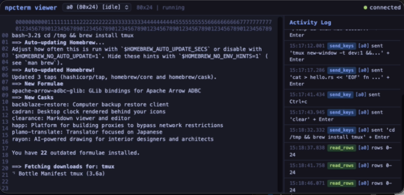

<p align="center">
  
</p>

# NPCterm

The ultimate harness agent tool. A headless, in-memory terminal emulator for AI agents, exposed via [MCP](https://modelcontextprotocol.io/) (Model Context Protocol).

NPCterm gives AI agents **full terminal access**. The ability to spawn shells, run arbitrary commands, read screen output, send keystrokes, and interact with TUI applications. This is one of the most powerful capabilities you can grant an AI agent: it is effectively equivalent to giving it access to a computer.

> **Use with precautions.** A terminal is an unrestricted execution environment. Any command the agent can type, the system will run. This includes installing software, modifying files, accessing the network, and anything else a shell user can do. Deploy NPCterm in sandboxed or controlled environments, and always apply the principle of least privilege. Do not expose it to untrusted agents without appropriate safeguards.

<p align="center">
  
</p>

Full system monitoring with `btop`, launched, read, and navigated entirely by an AI agent through MCP tools.


## Features

- **Full ANSI/VT100 terminal emulation** with PTY spawning via `portable-pty`
- **17 MCP tools** for complete terminal control over JSON-RPC stdio
- **Built on [TurboMCP](https://github.com/Epistates/turbomcp) 3.0** -- production-grade MCP SDK with auto-generated tool schemas
- **Multi-version MCP protocol support** -- compatible with clients using `2024-11-05`, `2025-06-18`, or `2025-11-25` spec versions
- **Incremental screen reads** with dirty-row tracking for efficient output consumption
- **Process state detection**: knows when a command is running, idle, waiting for input, or exited
- **Event system**: ring buffer of terminal events (CommandFinished, WaitingForInput, Bell, etc.)
- **AI-friendly coordinate overlay** for precise screen navigation
- **Mouse, selection, and scroll support** for interacting with TUI applications
- **Multiple concurrent terminals** with short 2-character IDs
- **Built-in web debug viewer** -- live terminal rendering and activity log in the browser, controllable via MCP tools

## Install

```bash
cargo install npcterm
```

### Install for any AI CLI / IDE

Installs the binary and auto-configures it for every MCP client detected: **Claude Code**, **Claude Desktop**, **Codex**, **OpenCode**, **OpenClaw**.

```sh
curl -fsSL https://raw.githubusercontent.com/alejandroqh/marketplace/main/h39.sh | bash
```

### Pre-built binaries

Pre-built binaries are available in the [`dist/`](dist/) directory for:

- macOS ARM64 (Apple Silicon) / x64 (Intel)
- Linux ARM64 / x64
- Windows x64

Download the binary for your platform and place it somewhere in your `PATH`.

### Build from source

```bash
cargo build --release
```

The binary will be at `target/release/npcterm`.

### MCP config

Add to your MCP client config:

```json
{
  "mcpServers": {
    "npcterm": {
      "command": "npcterm"
    }
  }
}
```

## Usage

NPCterm is an MCP server. It communicates over stdin/stdout using JSON-RPC. To use it, configure it as an MCP server in your AI agent's MCP configuration (see install instructions above).

### Available Tools

| Tool | Description |
|------|-------------|
| `terminal_create` | Spawn a new terminal (80x24, 120x40, 160x40, or 200x50). Optional `shell` param to specify shell path |
| `terminal_destroy` | Destroy a terminal and its PTY |
| `terminal_list` | List all active terminals |
| `terminal_send_key` | Send a single keystroke |
| `terminal_send_keys` | Send a sequence of keystrokes |
| `terminal_mouse` | Send mouse events (click, scroll, drag) |
| `terminal_read_screen` | Read the screen with coordinate overlay (full or `mode: "changes"` for incremental reads) |
| `terminal_show_screen` | Read screen as plain text without coordinates |
| `terminal_read_rows` | Read specific rows from the screen |
| `terminal_read_region` | Read a rectangular region of the screen |
| `terminal_status` | Get terminal status, process state, and `has_new_content` flag |
| `terminal_poll_events` | Poll the event queue |
| `terminal_select` | Select text on screen |
| `terminal_scroll` | Scroll the terminal viewport |
| `viewer_start` | Start the web debug viewer (default port 8039, auto-probes if busy) |
| `viewer_stop` | Stop the web debug viewer |
| `viewer_open` | Open the debug viewer in the system browser (starts it if needed) |

### Example: Yes, your agent now can quit Vim

```jsonc
// MCP Flow
// 1. Create a terminal
// -> terminal_create {}
// <- {"id": "a0", "cols": 80, "rows": 24}

// 2. Open vim
// -> terminal_send_keys {"id": "a0", "input": [{"text": "vim"}, {"key": "Enter"}]}
// <- {"success": true}

// 3. Read the screen to confirm vim is open
// -> terminal_show_screen {"id": "a0"}
// <- ~                              VIM - Vi IMproved
// <- ~                               version 9.2.250
// <- ~                           by Bram Moolenaar et al.
// <- ~                type  :q<Enter>               to exit
// <- ...

// 4. Quit vim (the hard part, apparently)
// -> terminal_send_keys {"id": "a0", "input": [{"text": ":q"}, {"key": "Enter"}]}
// <- {"success": true}

// Back at the shell. First try.
```

<p align="center">
  
</p>

NPCterm gives AI agents full TUI interaction: opening, navigating, and closing interactive programs like `vim`, `htop`, `less`, or any curses-based application.

## Debug Viewer

NPCterm includes a built-in web-based debug viewer that lets you watch your agent work in real time. Start it on-demand with the `viewer_start` MCP tool or open it directly in your browser with `viewer_open`.

<p align="center">
  
</p>

The viewer provides:

- **Live terminal rendering** -- Full-color terminal output updated in real time via WebSocket, including cursor position and process state. Switch between active terminals from a dropdown.
- **Activity log** -- A sidebar showing every MCP tool call your agent makes: timestamps, tool name, terminal ID, parameters, and a summary of the result. Color-coded by category (input, read, lifecycle, mouse).
- **Zero setup** -- Single embedded HTML page served from the binary. No external dependencies, no npm, no build step. Just call `viewer_start` and open your browser.
- **On-demand** -- The viewer doesn't run unless you ask for it. Start with `viewer_start` (default port 8039), stop with `viewer_stop`, or let `viewer_open` handle both starting and opening the browser in one call. If the default port is taken, it automatically tries the next 10 ports.

The viewer is especially useful for:

- **Debugging agent behavior** -- See exactly what the agent sees on screen, and correlate it with the tool calls in the activity log.
- **Live demos** -- Show stakeholders what your agent is doing without giving them MCP access.
- **Development** -- Iterate on agent prompts while watching the terminal output update in real time.

<p align="center">
  <em>Video coming soon</em>
</p>

## Architecture

```
TurboMCP Server (stdio JSON-RPC)
       |
  NpcTermServer (17 #[tool] methods)
       |
  TerminalRegistry (concurrent terminal management)
       |
  TerminalInstance (emulator + mouse + selection + events)
       |
  TerminalEmulator (PTY spawn, I/O threads, grid)
    |-- TerminalGrid (screen buffer, scrollback, dirty tracking)
    |   '-- AnsiHandler (VTE parser)
    |-- TerminalCell (character + style attributes)
    '-- PTY (portable-pty)
```

The MCP layer is powered by [TurboMCP](https://github.com/Epistates/turbomcp) 3.0, which handles JSON-RPC protocol framing, tool schema generation, and request dispatch. Each terminal spawns a background PTY reader thread. A global tick thread (10ms interval) drains PTY output through the VTE parser, detects process state changes, and emits events.

## For Agent Builders

Features designed for efficient, long-running AI agent workflows:

### Token-Efficient Screen Reads

- **Incremental reads** -- `terminal_read_screen` with `mode: "changes"` returns only new output since the last read, capped to `max_lines` (default 50, max 200). No need to re-read the entire screen after every command.
- **`has_new_content` flag** -- `terminal_status` includes a boolean flag so agents can skip screen reads entirely when nothing changed. Cheap polling without wasting tokens.
- **Coordinate overlay** -- `terminal_read_screen` adds column/row headers so agents can target specific cells with `terminal_read_region` or `terminal_select` without manual counting.
- **Plain text mode** -- `terminal_show_screen` returns raw screen content without coordinates, ideal for piping output to other tools or summarization.

### Process State Awareness

- **Four states**: `Running`, `Idle` (no output >500ms), `WaitingForInput` (shell prompt detected), `Exited` (with exit code). Agents know exactly when a command finishes and the shell is ready for the next one.
- **Event queue** -- `terminal_poll_events` drains events like `CommandFinished`, `WaitingForInput`, `Bell`, `ProcessStateChanged`, and `ScreenChanged` (with row indices). Build event-driven agents instead of blind polling loops.

### Custom Shell and Environment

- **Any shell** -- Pass `shell: "/bin/zsh"`, `shell: "/usr/local/bin/fish"`, or any path to `terminal_create`. Defaults to the system shell if omitted.
- **Multiple sizes** -- 80x24 for simple commands, 120x40 for modern TUIs, 160x40 or 200x50 for dense dashboards. Match the viewport to the application being automated.
- **Concurrent terminals** -- Run parallel tasks in separate terminals. Short 2-character IDs (e.g., `a0`, `b3`) minimize token overhead vs UUIDs.

### Web Debug Viewer

- **Live terminal view** -- `viewer_start` launches a browser-based UI showing real-time terminal output with cursor position, process state, and full color rendering.
- **Activity log** -- Every MCP tool call is logged with timestamp, parameters, and result. See exactly what your agent is doing and when.
- **On-demand** -- Start and stop the viewer via MCP tools (`viewer_start`, `viewer_stop`, `viewer_open`). Default port 8039, auto-probes next 10 ports if busy.

## Engine

Ported from project [term39](https://github.com/alejandroqh/term39)

## Security Considerations

NPCterm provides **unrestricted shell access** to whatever agent connects to it. Before deploying:

- **Sandbox the environment.** Run inside containers, VMs, or other isolation boundaries.
- **Limit the agent's permissions.** Use restricted user accounts, filesystem permissions, and network policies.
- **Monitor activity.** Log terminal events and review agent behavior.
- **Do not run as root.** The PTY inherits the permissions of the NPCterm process.
- **Treat this as you would SSH access.** If you wouldn't give the agent an SSH session to the machine, don't give it NPCterm either.

## License

Apache 2

