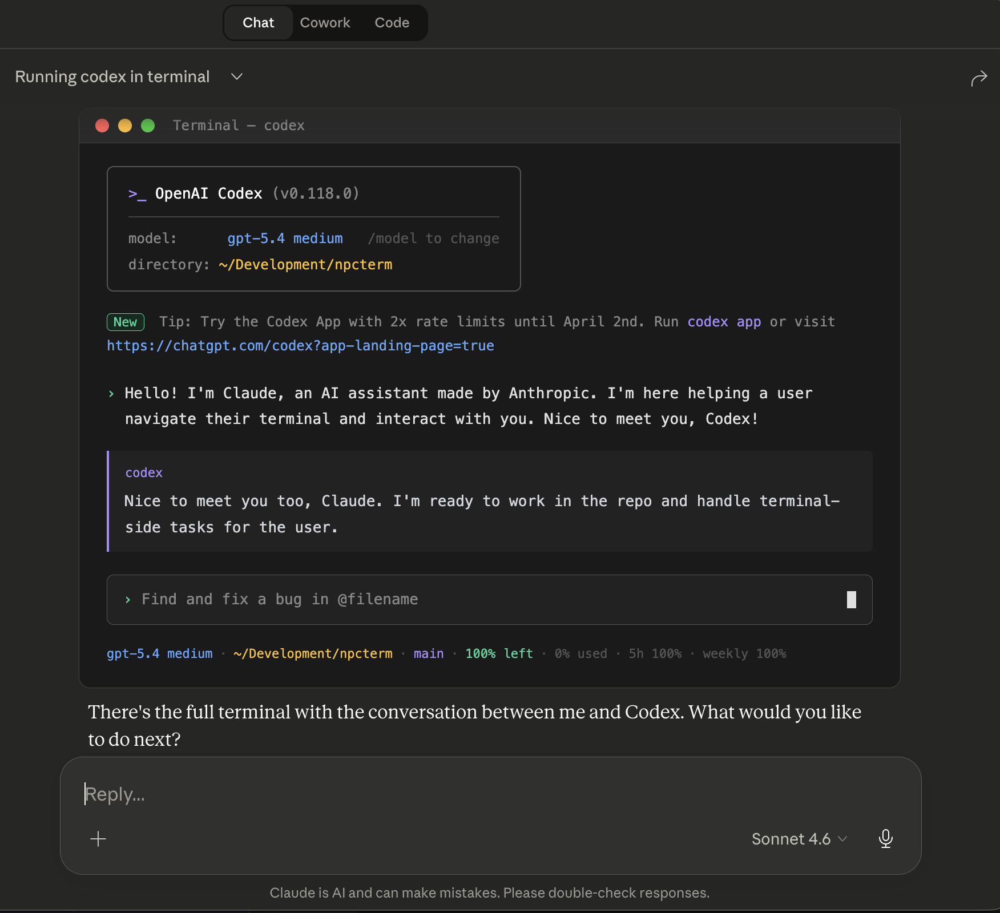
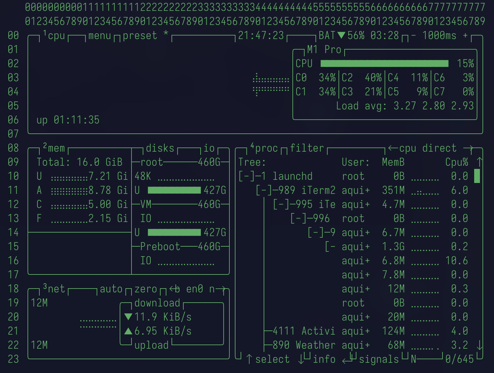

<p align="center">
  
</p>

# NPCterm

The ultimate harness agent tool. A headless, in-memory terminal emulator for AI agents, exposed via [MCP](https://modelcontextprotocol.io/) (Model Context Protocol).

NPCterm gives AI agents **full terminal access**. The ability to spawn shells, run arbitrary commands, read screen output, send keystrokes, and interact with TUI applications. This is one of the most powerful capabilities you can grant an AI agent: it is effectively equivalent to giving it access to a computer.

> **Use with precautions.** A terminal is an unrestricted execution environment. Any command the agent can type, the system will run. This includes installing software, modifying files, accessing the network, and anything else a shell user can do. Deploy NPCterm in sandboxed or controlled environments, and always apply the principle of least privilege. Do not expose it to untrusted agents without appropriate safeguards.

## Features

- **Full ANSI/VT100 terminal emulation** with PTY spawning via `portable-pty`
- **14 MCP tools** for complete terminal control over JSON-RPC stdio
- **Built on [TurboMCP](https://github.com/Epistates/turbomcp) 3.0** -- production-grade MCP SDK with auto-generated tool schemas
- **Multi-version MCP protocol support**: compatible with clients using `2024-11-05`, `2025-06-18`, or `2025-11-25` spec versions
- **Incremental screen reads** with dirty-row tracking for efficient output consumption
- **Process state detection**: knows when a command is running, idle, waiting for input, or exited
- **Event system**: ring buffer of terminal events (CommandFinished, WaitingForInput, Bell, etc.)
- **AI-friendly coordinate overlay** for precise screen navigation
- **Mouse, selection, and scroll support** for interacting with TUI applications
- **Multiple concurrent terminals** with short 2-character IDs

## Install

### Option 1: Install with Cargo (recommended)

```bash
cargo install npcterm
```

This installs `npcterm` to your Cargo bin directory (usually `~/.cargo/bin/`), making it available system-wide.

### Option 2: Download pre-built binaries

Pre-built binaries are available in the [`dist/`](dist/) directory for:

- macOS ARM64 (Apple Silicon) / x64 (Intel)
- Linux ARM64 / x64
- Windows x64

Download the binary for your platform and place it somewhere in your `PATH`.

### Option 3: Build from source

```bash
cargo build --release
```

The binary will be at `target/release/npcterm`.

### OpenClaw

[OpenClaw](https://openclaw.ai/) has built-in MCP support. Install NPCterm as a plugin directly:

```bash
# From the GitHub repo
openclaw plugins install https://github.com/alejandroqh/npcterm.git

# Or from a local clone
git clone https://github.com/alejandroqh/npcterm.git
openclaw plugins install ./npcterm
```

Once installed, all 14 NPCterm tools will be available to your OpenClaw agent as `npcterm__terminal_create`, `npcterm__terminal_send_keys`, etc.

Verify the server is registered with:

```bash
openclaw mcp list
```

### Claude Desktop / Claude Code

First install NPCterm:

```bash
cargo install npcterm
```

Then add it to your MCP configuration:

```json
{
  "mcpServers": {
    "npcterm": {
      "command": "npcterm"
    }
  }
}
```

If you downloaded a pre-built binary instead, use the full path as the `"command"` value.

## Usage

NPCterm is an MCP server. It communicates over stdin/stdout using JSON-RPC. To use it, configure it as an MCP server in your AI agent's MCP configuration (see install instructions above).

### Available Tools

| Tool | Description |
|------|-------------|
| `terminal_create` | Spawn a new terminal (80x24, 120x40, 160x40, or 200x50) |
| `terminal_destroy` | Destroy a terminal and its PTY |
| `terminal_list` | List all active terminals |
| `terminal_send_key` | Send a single keystroke |
| `terminal_send_keys` | Send a sequence of keystrokes |
| `terminal_mouse` | Send mouse events (click, scroll, drag) |
| `terminal_read_screen` | Read the screen buffer (full or `mode: "changes"` for incremental reads, with configurable `max_lines`) |
| `terminal_show_screen` | Read screen with coordinate overlay headers |
| `terminal_read_rows` | Read specific rows from the screen |
| `terminal_read_region` | Read a rectangular region of the screen |
| `terminal_status` | Get terminal status, process state, and `has_new_content` flag |
| `terminal_poll_events` | Poll the event queue |
| `terminal_select` | Select text on screen |
| `terminal_scroll` | Scroll the terminal viewport |

### Example: Yes, your agent now can quit Vim

```jsonc
// MCP Flow
// 1. Create a terminal
// -> terminal_create {}
// <- {"id": "a0", "cols": 80, "rows": 24}

// 2. Open vim
// -> terminal_send_keys {"id": "a0", "input": [{"text": "vim"}, {"key": "Enter"}]}
// <- {"success": true}

// 3. Read the screen to confirm vim is open
// -> terminal_show_screen {"id": "a0"}
// <- ~                              VIM - Vi IMproved
// <- ~                               version 9.2.250
// <- ~                           by Bram Moolenaar et al.
// <- ~                type  :q<Enter>               to exit
// <- ...

// 4. Quit vim (the hard part, apparently)
// -> terminal_send_keys {"id": "a0", "input": [{"text": ":q"}, {"key": "Enter"}]}
// <- {"success": true}

// Back at the shell. First try.
```

<p align="center">
  
</p>

NPCterm gives AI agents full TUI interaction: opening, navigating, and closing interactive programs like `vim`, `htop`, `less`, or any curses-based application.

### Example: btop running inside NPCterm, controlled by an agent

<p align="center">
  
</p>

Full system monitoring with `btop`, launched, read, and navigated entirely by an AI agent through MCP tools.

## Architecture

```
TurboMCP Server (stdio JSON-RPC)
       |
  NpcTermServer (14 #[tool] methods)
       |
  TerminalRegistry (concurrent terminal management)
       |
  TerminalInstance (emulator + mouse + selection + events)
       |
  TerminalEmulator (PTY spawn, I/O threads, grid)
    |-- TerminalGrid (screen buffer, scrollback, dirty tracking)
    |   '-- AnsiHandler (VTE parser)
    |-- TerminalCell (character + style attributes)
    '-- PTY (portable-pty)
```

The MCP layer is powered by [TurboMCP](https://github.com/Epistates/turbomcp) 3.0, which handles JSON-RPC protocol framing, tool schema generation, and request dispatch. Each terminal spawns a background PTY reader thread. A global tick thread (10ms interval) drains PTY output through the VTE parser, detects process state changes, and emits events.

## Engine

Ported from project [term39](https://github.com/alejandroqh/term39)

## Security Considerations

NPCterm provides **unrestricted shell access** to whatever agent connects to it. Before deploying:

- **Sandbox the environment.** Run inside containers, VMs, or other isolation boundaries.
- **Limit the agent's permissions.** Use restricted user accounts, filesystem permissions, and network policies.
- **Monitor activity.** Log terminal events and review agent behavior.
- **Do not run as root.** The PTY inherits the permissions of the NPCterm process.
- **Treat this as you would SSH access.** If you wouldn't give the agent an SSH session to the machine, don't give it NPCterm either.

## License

Apache 2

